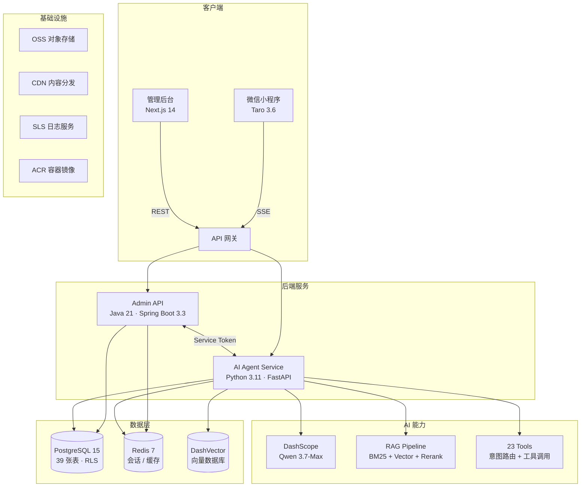

# AI 智能客服系统（AIKF）

> 面向通用行业的多租户 AI 智能客服 SaaS 平台，以布艺窗帘行业为示例场景。  
> 基于大语言模型（通义千问）+ RAG 知识库 + 23 个业务工具，覆盖售前咨询到售后服务全链路。

## ✨ 核心亮点

- **双 Agent 架构** — C 端客服"小布" + B 端工作助手"米宝"，LangGraph 状态图驱动
- **23 个 AI 工具** — 商品搜索、订单管理、物流追踪、知识库检索等，自动意图路由
- **RAG 知识库** — BM25 + 向量混合检索 + Reranker，支持文档上传与自动分块
- **多租户 SaaS** — 5 层隔离（JWT → MyBatis 拦截器 → PostgreSQL RLS → DashVector → 字段脱敏）
- **完整业务后台** — 商品、订单、CRM、人工坐席、数据看板等 12+ 管理模块
- **微信小程序** — Taro 跨端框架，SSE 流式对话，原生体验
- **阿里云全栈部署** — Terraform IaC + SAE + RDS + OSS + CDN，GitHub Actions CI/CD

## 🏗️ 系统架构



## 🛠️ 技术栈

| 层级 | 技术 | 版本 |
|------|------|------|
| **后端 — 管理 API** | Java + Spring Boot + MyBatis-Plus + Spring Security | JDK 21 / Boot 3.3.5 / MP 3.5.8 |
| **后端 — AI 服务** | Python + FastAPI + LangChain + LangGraph | 3.11 / FastAPI 0.115 / LC 0.3.14 / LG 0.2.60 |
| **前端 — 管理后台** | Next.js (App Router) + React + TypeScript + Tailwind CSS | 14.2 / React 18 / TS 5.7 |
| **前端 — 微信小程序** | Taro + React + TypeScript + Sass | 3.6.40 / React 18 |
| **数据库** | PostgreSQL + Redis | PG 15 / Redis 7 |
| **向量数据库** | DashVector（阿里云） | — |
| **大语言模型** | 阿里云百炼 DashScope（Qwen 系列） | qwen-3.7-max / qwen-turbo |
| **认证** | RS256 JWT (BouncyCastle) + 微信小程序登录 + 短信验证码 | — |
| **部署** | 阿里云 SAE + RDS + Redis + OSS + CDN + Terraform + GitHub Actions | — |

## 📦 功能概览

### C 端 — AI 智能客服（微信小程序）

| 能力 | 说明 |
|------|------|
| 售前咨询 | 产品推荐、材质介绍、风格搭配、窗帘尺寸计算 |
| 订单服务 | 下单查询、状态跟踪、历史订单 |
| 售后处理 | 退货/换货/投诉、问题跟踪 |
| 物流查询 | 实时物流状态、配送时间预估 |
| 知识库问答 | 基于 RAG 的产品知识和 FAQ 问答 |
| 图片识别 | 窗帘/面料图片分析（qwen-vl-plus） |
| 人工转接 | AI 自动判断并转接人工坐席 |
| 多轮对话 | 上下文维护、会话记忆、智能追问 |

### B 端 — 管理后台

| 模块 | 说明 |
|------|------|
| 数据看板 | 订单趋势、状态分布、活跃会话、关键指标 |
| 商品管理 | CRUD、SKU 矩阵（颜色×售卖方式×门幅）、加工项关联、批量上下架 |
| 分类管理 | 树形商品分类 |
| 加工项管理 | 窗帘加工工艺（锁边、褶皱、挂钩等）及计价 |
| 订单管理 | 全生命周期（待付款→确认→生产→发货→完成）、发货、退款、跟进状态 |
| 售后工单 | 退货/换货/维修/投诉工单流转 |
| 客户 CRM | 客户画像、标签管理、客户分群、RFM 评分 |
| 人工坐席 | 坐席管理、会话分配、快捷回复 |
| 知识库 | 文档上传、自动分块、向量嵌入、检索测试 |
| 通知中心 | 模板消息、规则引擎、多渠道推送 |
| 角色权限 | RBAC 五角色、细粒度权限、动态菜单 |
| 系统设置 | AI 配置（模型/温度/提示词）、租户信息、密码管理 |

## 📁 项目结构

```
youke/
├── backend/
│   ├── admin-api/              # Java 管理后台 API（Spring Boot 3.3）
│   │   ├── src/main/java/com/migao/admin/
│   │   │   ├── controller/     # 19 个 REST Controller
│   │   │   ├── service/        # 21 个业务 Service
│   │   │   ├── entity/         # 31 个数据实体
│   │   │   ├── mapper/         # 31 个 MyBatis-Plus Mapper
│   │   │   ├── dto/            # 44 个请求/响应 DTO
│   │   │   ├── security/       # JWT RS256 + RBAC + 多租户
│   │   │   └── config/         # 全局配置、异常处理、多租户拦截器
│   │   ├── src/test/           # 15 个单元/集成测试
│   │   ├── pom.xml
│   │   ├── Dockerfile
│   │   └── .env.example
│   │
│   └── ai-agent-service/       # Python AI Agent 服务（FastAPI + LangGraph）
│       ├── app/
│       │   ├── agents/         # 双 Agent：小布（C端）+ 米宝（B端）
│       │   ├── api/            # SSE 流式聊天 + 内部 API
│       │   ├── graph/          # LangGraph 状态图（意图路由→工具调用→响应）
│       │   ├── tools/          # 23 个业务工具
│       │   ├── rag/            # RAG Pipeline（BM25 + DashVector + Reranker）
│       │   ├── router/         # 意图分类（LLM + 规则引擎）
│       │   ├── llm/            # LLM 工厂、模型路由、成本追踪
│       │   ├── cache/          # 语义缓存
│       │   └── memory/         # 会话记忆
│       ├── tests/              # 30+ 测试用例
│       ├── requirements.txt
│       ├── Dockerfile
│       └── .env.example
│
├── frontend/
│   ├── admin-web/              # Next.js 14 管理后台（App Router + 静态导出）
│   │   ├── src/app/            # 页面路由（Dashboard、商品、订单、CRM…）
│   │   ├── src/components/     # 40+ React 组件
│   │   ├── src/lib/            # API 客户端、工具函数
│   │   ├── package.json
│   │   └── .env.development / .env.production
│   │
│   └── mini-app/               # Taro 3.6 微信小程序
│       ├── src/pages/          # 对话、会话列表、个人中心
│       ├── src/components/     # 消息气泡、产品卡片、物流卡片等
│       └── package.json
│
├── deploy/
│   ├── docker-compose.yml      # 本地开发（PostgreSQL + Redis + 双后端）
│   ├── terraform/              # 阿里云 IaC（VPC、RDS、SAE、OSS…）
│   └── oss-*.xml               # OSS 静态托管配置
│
├── docs/
│   ├── architecture/           # 架构设计文档（4 篇）
│   ├── api/                    # API 参考文档
│   ├── design/                 # 产品设计文档（4 篇）
│   ├── deployment/             # 部署指南（4 篇）
│   └── sql/                    # 数据库 Schema + 增量迁移脚本
│
├── tests/smoke/                # E2E 冒烟测试（11 个测试文件）
├── knowledge_base/             # RAG 种子数据（产品目录、FAQ、尺寸指南）
└── .github/workflows/          # CI/CD（3 个部署流水线）
```

## 🚀 快速开始

### 前置条件

| 工具 | 最低版本 | 用途 |
|------|---------|------|
| JDK | 21 | admin-api 编译运行 |
| Node.js | 18+ | admin-web 前端 |
| Python | 3.11+ | ai-agent-service |
| Docker + Docker Compose | — | 本地数据库（推荐） |

### 方式一：Docker Compose（推荐）

一键启动数据库和双后端服务：

```bash
cd deploy

# 配置 AI 服务环境变量（首次）
export DASHSCOPE_API_KEY=your_key
export DASHSCOPE_MODEL=qwen-turbo

# 启动所有服务
docker-compose up --build

# 服务启动后：
# - Admin API:       http://localhost:8080
# - AI Agent:        http://localhost:8000
# - PostgreSQL:      localhost:5432
# - Redis:           localhost:6379
```

### 方式二：逐服务启动

#### 1. 启动基础设施

```bash
cd deploy
docker-compose up postgres redis   # 仅启动数据库和缓存
```

#### 2. 启动 Admin API（Java）

```bash
cd backend/admin-api
cp .env.example .env
# 编辑 .env 配置数据库、Redis、JWT 密钥等

./mvnw spring-boot:run
# → http://localhost:8080
```

#### 3. 启动 AI Agent Service（Python）

```bash
cd backend/ai-agent-service
python -m venv venv && source venv/bin/activate
pip install -r requirements.txt
cp .env.example .env
# 编辑 .env 配置 DashScope API Key、DashVector、数据库连接等

uvicorn app.main:app --reload --host 0.0.0.0 --port 8000
# → http://localhost:8000
```

#### 4. 启动管理后台前端（Next.js）

```bash
cd frontend/admin-web
npm install
npm run dev
# → http://localhost:3001
```

#### 5. 启动微信小程序（Taro）

```bash
cd frontend/mini-app
npm install
npm run dev:weapp
# 微信开发者工具打开 dist/ 目录
```

## 🧪 测试

```bash
# Java 单元测试（admin-api）
cd backend/admin-api && ./mvnw test

# Python 测试（ai-agent-service）
cd backend/ai-agent-service && pytest

# E2E 冒烟测试
cd tests/smoke && pytest
```

## 🚢 部署

本项目使用 **GitHub Actions** 自动部署到阿里云。标准流程：

```
本地开发 → 创建功能分支 → 提交代码 → 创建 PR → Review 通过 → 合并到 main → 自动部署
```

### 自动触发规则

代码合并到 `main` 分支时，根据变更文件路径自动触发对应工作流：

| 工作流 | 触发路径 | 构建方式 | 部署目标 |
|--------|---------|---------|---------|
| `deploy-admin-api` | `backend/admin-api/**` | Maven → FatJar → OSS | SAE (FatJar) |
| `deploy-ai-agent-service` | `backend/ai-agent-service/**` | Docker → ACR | SAE (镜像) |
| `deploy-admin-web` | `frontend/admin-web/**` | Next.js 静态导出 | OSS + CDN |

### 快速部署示例

```bash
# 1. 创建功能分支
git checkout -b feat/backend/xxx

# 2. 开发完成后提交
git add . && git commit -m "feat(backend): xxx"
git push origin feat/backend/xxx

# 3. 创建 PR 并合并
gh pr create --title "[backend] xxx" --base main
gh pr merge --squash --delete-branch

# 4. ✅ GitHub Actions 自动部署，无需额外操作
```

每个工作流都支持在 GitHub Actions 页面手动触发（`workflow_dispatch`）。

### 详细部署文档
- [阿里云部署指南](docs/deployment/deployment-aliyun.md) — Terraform + SAE + RDS 完整配置 + **CI/CD 流水线详解**
- [部署检查清单](docs/deployment/deployment-checklist.md) — 17 个历史踩坑记录
- [认证与部署](docs/deployment/auth-and-deployment.md) — JWT、OAuth、API 网关路由

## 📖 项目文档

| 类别 | 文档 | 说明 |
|------|------|------|
| **架构** | [系统架构设计](docs/architecture/architecture.md) | 双微服务拓扑、多租户、Hermes Agent 框架 |
| | [多租户多平台](docs/architecture/multi-tenant-multi-platform.md) | SaaS 架构、跨平台身份识别 |
| | [RAG 架构](docs/architecture/rag-architecture.md) | 混合检索 + Reranker 全链路设计 |
| | [生产级 AI 架构](docs/architecture/production-ai-architecture.md) | 确定性 Pipeline 备选方案 |
| **API** | [API 参考文档](docs/api/api-reference.md) | 全量接口定义 + SSE 协议 |
| **设计** | [UI 设计规范](docs/design/ui-design-spec.md) | 色彩、字体、组件、响应式 |
| | [管理后台设计](docs/design/admin-dashboard-design.md) | 页面路由、权限矩阵、CRM |
| | [坐席工作台设计](docs/design/agent-workspace-design.md) | 人工坐席流程、WebSocket |
| | [工具规范](docs/design/skill-spec.md) | 23 个 AI 工具定义与安全层 |

## 📊 项目进度

当前整体进度 **~74%**，处于第三阶段（MVP 测试与上线）。

| 阶段 | 进度 | 说明 |
|------|------|------|
| 阶段一：基础设施 | 85% | 脚手架、数据库 39 张表、Docker、Terraform |
| 阶段二：MVP 核心 | 97% | 商品 CRUD、AI 工具、小程序、RAG、SSE |
| 阶段三：测试上线 | 20% | 单元测试、集成测试、CI/CD、生产部署 |

## 🤝 贡献指南

### 分支策略

| 分支 | 用途 |
|------|------|
| `main` | 受保护，仅通过 PR 合入 |
| `feat/frontend/*` | 前端功能 |
| `feat/backend/*` | 后端功能 |
| `fix/*` | Bug 修复 |
| `hotfix/*` | 紧急修复 |

### Commit 规范

```
feat(frontend): 添加商品批量上架功能
fix(backend): 修复多租户数据隔离问题
test: 补充订单状态机单元测试
```

## 📄 许可证

[MIT License](LICENSE)
